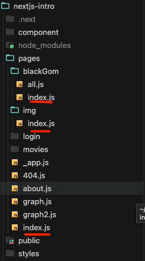

# NextJs13

```properties
# ℹ️ Next14버전과 큰 차이는 없지만 현재 예제 코드에서는
#  ㄴ> Next13(Page Route) 방식을 사용하였기에 나눠서 표시함
```

## Routing - Pages 사용 방법 [Next13 이전]

- `react-router-dom`가 기본적으로 내장 되어있다.
- `pages`폴더 내부의 js파일명 기준으로 `/path`가 결정된다.

  - ⭐️ `index.js`의 경우 특별한 케이스로 무조건 root Path로 인식한다.

  

- `.js`파일의 파일명이 중요하지 내부의 함수명은 자유이다. Url의 Path에 영향이 없다.
  ```javascript
  // about.js
  /**
   * 중요 포인트
   * - 함수명은 어떤것이든 상관 없다 routing의 기준은 해당 js파일명을 따라 생성된다.
   * - export할 경우 무조건 "epxort default" 이어야한다!
   *  - error : Error: The default export is not a React Component in page
   */
  export default function google() {
    return <div>about</div>;
  }
  ```
- `export`는 필수이며 무조건 `export default`를 사용해서 모듈화 해줘야한다.
  - Next.js 프레임워크 자체에서 그렇게 정의하였으므로 따라 사용하면 된다.

## Data Fetching

- 상단에 **"use client";** 선언이 필요하다

  - `SSR`하는 설정 사용이 불가능 하다
    - Ex) `Metadata` 설정 불 가능

  ```javascript
  // ⭐️ 꼭 선언해 줘야한다
  "use client";

  import Link from "next/link";
  import "./globals.css";
  import { useEffect, useState } from "react";

  // 👉 해당 코드는 "use client"를 사용 할 경우 사용이 불가능 - SSR로 랜더링 하기 떄문
  // export const metadata = {
  //   title: "Create Next App222",
  //   description: "Generated by create next app",
  // };

  export default function RootLayout({ children }) {
    const [topics, setTopics] = useState([]);
    useEffect(() => {
      fetch("http://localhost:9999/topics")
        .then((res) => res.json())
        .then((result) => setTopics(result))
        .catch((e) => console.log(e));
    }, []);

    console.log(topics);

    return <></>;
  }
  ```

### Dynamic Routes

- 시나리오
  - 메인 `layout.js`에서 하단의 수정, 삭제 버튼을 `[id]`값의 유무로 `Show/Hide` 처리
  - 컴포넌트를 나눠준 후 `useParams()`사용으로 Id값 가져와 처리
- 문제 사항
  - MedataData를 쓰고 싶기에 `"use client"`사용이 불가능한 상황
- 사용 예시

  - 단일 컴포넌트 👎

    ```javascript
    /** layout.js */
    import Link from "next/link";
    import "./globals.css";
    // ❌ 하지만 Client Component로 변경하기엔 어려운 상황임
    export const metadata = {
      title: "Create Next App222",
      description: "Generated by create next app",
    };
    export default async function RootLayout({ children }) {
      return (
        <html>
          <body>
            {children}
            /** * 👉 해당 부분이 http://localhost:3000/read/14 와 같이 * id에 따라
            보이고 안보이고 하고싶은 사오항 */
            <ul>
              <li>
                <Link href="/create">Create</Link>
              </li>
              <li>
                <Link href="/update/1">Update</Link>
              </li>
              <li>
                <button>Delete</button>
              </li>
            </ul>
          </body>
        </html>
      );
    }
    ```

  - 컴포넌트를 나눠서 처리 👍

    ```javascript
    // Control 컴포넌트
    "use client";
    import Link from "next/link";
    import { useParams } from "next/navigation";

    export function Control() {
      // 👉 PathVariable값을 받아올 수 있게 되었다.
      const params = useParams();
      const id = params.id;
      console.log(id);
      return (
        <ul>
          <li>
            <Link href="/create">Create</Link>
          </li>
          // 👉 조건식을 사용해서 보이고 안보이고 설정
          {id ? (
            <>
              <li>
                <Link href="/update/1">Update</Link>
              </li>
              <li>
                <button>Delete</button>
              </li>
            </>
          ) : null}
        </ul>
      );
    }

    /****************************************************/

    // layout.js - Control 컴포넌트를 불러와서 처리
    import Link from "next/link";
    import "./globals.css";
    import { Control } from "./Control";
    export const metadata = {
      title: "Create Next App222",
      description: "Generated by create next app",
    };
    export default async function RootLayout({ children }) {
      return (
        <html>
          <body>
            {children}
            <Control />
          </body>
        </html>
      );
    ```

## `useRouter()`

- 해당 Url에 대한 정보를 가져와서 사용이 가능하다.
- NextJs 설치 시 자동으로 설치되어 있기에 바로 사용하면 된다.
- 예시 코드

  ```javascript
  import Link from "next/link";
  import { useRouter } from "next/router";

  const activeNav = (path) => {
    // 💬 NextJs에서 기본적으로 router가 설치되어 있기 때문에 사용만 하면된다.
    //    - 해당 함수 내에는 rotuer에 대한 여러가지 정보를 받아서 사용이 가능함
    const router = useRouter;
    return {
      color: path === router().pathname ? "red" : null,
    };
  };

  export default function NavBar() {
    return (
      <nav>
        <Link href="/" style={activeNav("/")}>
          Home
        </Link>
        <Link href="/about" style={activeNav("/about")}>
          About
        </Link>
      </nav>
    );
  }
  ```

## 공통영역 처리 방법 - 전역 처리

- spring의 jsp 따지면 `include` Tymeleaf로 따지면 `fagment`로 생각하면 좋다.
- 공통적인 틀을 만드는 것은 물론이고 Global css 또한 해당 위치에 적용해야한다 그렇지 않으면 에러가 발생한다.
  - ⭐️ 일반 컴포넌트에 CSS 적용 시 발생 하는 에러
    - Message : Global CSS cannot be imported from files other than your Custom <App>.
- 주의 사항

  - 1 . ⭐️ 파일명은 **무조건** `_app.js`이어야한다 . 프레임워크에서 컴포넌트중에서 가장 먼저 읽는 네이밍이기 때문이다!
  - 2 . 해당 컴포는트의 기본틀을 꼭 지켜주자

    - `{ Component, pagePrpos }` 파라미터로 받는 것
    - `<Component {...pagePrpos}></Component>`형태로 컴포넌트를 불러오는 것

    ```javascript
    /***
     * 👉 { Component, pagePrpos } 해당 파라미터 2개는 필수이다.
     * - 기본적인 틀이며 따르면 된다,.
     *  - Component 경우 우리가 생성하는 각각의 컴포넌트라 생각하고
     *  - pagePrpos 각각의 컴포넌트에 전달하는 pageProps이다
     */
    export default function App({ Component, pagePrpos }) {
      return (
        <>
          {/* ✅ 아래의 형식을 꼭 사용해야한다 스프레드 시트를 사용해서 pageProps를 넘겨주자 */}
          <Component {...pagePrpos}></Component>
        </>
      );
    }
    ```

- 활용 ( 전역 Css와 Nav Component 사용 )

  - \_app.js

    ```javascript
    // 👉 NavBar Import
    import NavBar from "@/component/NavBar";
    // 👉 전역 css를 불러와도 에러가 없다 👍
    import "../styles/globals.css";

    export default function App({ Component, pagePrpos }) {
      return (
        <>
          {/** 👉 Nav 컴포넌트 Call */}
          <NavBar></NavBar>

          <Component {...pagePrpos}></Component>

          <span>이런식으로 여러가지를 추가 가능함 ! Footer넣자!</span>
        </>
      );
    }
    ```

- `_app.js`를 사용할 경우 사용하는 패턴

  - 패턴 사용 이유
    - `_app.js`에는 공통적으로 사용해야하는 것들이 많이 Import 된다.
    - 그렇다면 엄청나게 길어질 것이며 이러한 코드는 보기도 관리하기도 힘들어진다.
  - 예시 코드

    - components -> Layout.js

      ```javascript
      import NavBar from "./NavBar";

      // 👉 하위로 들어온 모든 요소들은 children으로 받음
      export default function Layout({ children }) {
        return (
          <>
            <NavBar></NavBar>
            // 👉 사용
            <div>{children}</div>
          </>
        );
      }
      ```

    - \_app.js

      ```javascript
      import Layout from "@/component/Layout";
      import "../styles/globals.css";

      export default function App({ Component, pagePrpos }) {
        return (
          <>
            {/* ✅ Layout 하위에 들어온 컴포넌트 구조가 중요함 */}
            <Layout>
              <Component {...pagePrpos}></Component>
            </Layout>
          </>
        );
      }
      ```

## Header 정보 변경

- NextJs에서는 Header 정보를 쉽게 바꿀 수 있는 Library가 기본적으로 설치되어 있어 편하게 사용이 가능하다.
- 해당 `Head` 또한 랜더링 될 때 적용되므로 공통적으로 랜더링 되는 위치에 적용하는것이 옳다.
  - 그렇지 않으면 만약 about 컴포넌트에만 작업했다면 about에서만 적용됨.
- 예시 코드

  - HeadTitle.js

    ```javascript
    // 👉 NextJs 설치 시 자동으로 설치되어 있는 라이브러리 Import!
    import Head from "next/head";

    // 👉 Object형태로 파라미터가 넘어오기 떄문에 {}사용 필수!
    export default function HeadTitle({ titleName }) {
      return (
        // 👉 Head 사용해서 header에서 사용하는 값 변경이 가능하다!
        <Head>
          <title>{titleName} | Moive!</title>
        </Head>
      );
    }
    ```

  - Layout.js

        ```javascript
        import HeadTitle from "./HeadTitle";
        import NavBar from "./NavBar";

        export default function Layout({ children }) {
          return (
            <>
              {/* 👉 titleName파라미터명을 맞춰서 넘겨주자 */}
              <HeadTitle titleName={"Movie!"}></HeadTitle>
              <NavBar></NavBar>
              <div>{children}</div>
            </>
          );
        }
        ```

## pre rendering - 구버전용 .. 이제 쓸수 없음 레거시 코드에는 남아있을 수 있으니 .. 참고하자

- 특정 페이지 혹은 상황에 따라 데이터 목록을 로딩 후 보여지는 것이 아닌 서버에서 목록을 받아온 후 적용하게 할 수 있다.
  - 상황에 따라 `SEO`에 필요한 데이터를 홈 화면에 만들 경우 유용할 것으로 추측함
  - 로딩 화면이 없이 서버에서 데이터를 받고 그 후 다 받아진 이후 화면을 랜더링함.
- ⭐️ 사용 시 중요
  - `export`를 꼭 해줘야한다. --> `export async function `
  - 함수명이 틀리면 안된다. --> `getServerSideProps`
- 사용 예시

  - index.js

    ```javascript
    // 👉 { results } 룰 사용해서 ServerSideData를 받아옴
    export default function Home({ results }) {
      return (
        <div className="container">
          {results.map((item) => (
            <div className="movie" key={item.id}>
              
              <h4>{item.original_title}</h4>
            </div>
          ))}
        </div>
      );
    }

    // 👉 함수명이 중요함 NextJs에서 정해진 함수명임
    export async function getServerSideProps() {
      const { results } =
        await // 💬 서버에서 요청하므로 rewirte를 사용하기 위해서는 앞에 도메인 정보가 필수임
        (await fetch(`http://localhost:3000/api/movies`)).json();
      return {
        props: {
          results,
        },
      };
    }
    ```

## Dynamic Route - /path/\*\*

- 이전까지는 Path 정보가 하나 뿐인 컴포넌트를 불러오는 개념이었다면 이제는 변수값 혹은 좀 더 세분화된 url로 컴포넌트를 나눠서 사용가능하다.

- 간단하게 그냥 폴더를 두면 그게 하나의 path가 된다.
- 중요한건 해당 폴더 또한 컴포넌트를 갖게 하고싶다면 `index.js`라는 이름으로 컴포넌트를 생성하면 된다.
- 구조
  - page
    - blackGom
      - index.js : `localhost:3000/blackGome` 시 해당 컴포넌트가 화면에 도출
      - all.js : `localhost:3000/blackGome/all`

## PathVariable - [Next13 이전]

- 간단하다 해당 폴더를 생성 한 후 `[변수명].js`로 만들면 해당 변수를 `useRouter` Hook을 이용해 값을 받을 수 있다.
- 폴더 구조

  - pages
    - movive
      - [id].js
  - 사용 예시

    - [id].js

      ```javascript
      import { useRouter } from "next/router";

      export default function Detail() {
        // ⭐️ Hooke을 이용해서 내가 지정한 id값을 받아올 수 있음
        const router = useRouter;
        console.log(router().query.id);
        return <div>이렇게 받을수 있지요~</div>;
      }
      ```

## PathVariable - [Next13 이후]

- 사용할 새그먼트명 폴더를 생성 후 `[변수명]`폴더 생성
- 해당 폴더 내부에 `page.js` 생성
- 매개변수로 `{ params }`를 받아서 사용

  - 폴더 구조
  - src
    - app
      - read
        - [...id] or [id]
          - page.js
  - 사용 예시

    - page.js

      ```javascript
      export default function page({ params }) {
        // 👉 접근 시 :  http://localhost:3000/read/1/23/4
        console.log(params); // { id: [ '1', '23', '4' ] }
        return <div>{params.id}</div>;
      }
      ```

## All-Catch - [...id]일 경우 배열 형태로

- 이전 예제에서는 `loclahost:3000/movies/:id` 와 같은 식으로 한개의 값 만 받아 왔었지만 여러개를 배열로 받을 수 있다.
- 자주 사용되지는 않지만 알아두면 필요할 경우 유용하게 사용할 수 있다.
- 사용 방법

  - 기존 예제에서 사용하던 `[id].js`파일 -> `[...id].js`로 변경하면 알아서 배열로 받아온다!
  - [...id].js

    ```javascript
    import { useRouter } from "next/router";

    export default function Detail() {
      const router = useRouter();
      console.log("------------------");
      console.log(router.query.id); // 👉 [] 형태로 들어옴

      const id = router.query.id;
      return <div>{id}</div>;
    }
    ```

## `Link Tag`활용 및 `useRouter()`를 사용해서 같은 기능 구현

- 이벤트 함수를 생성하고 거기에 `useRouter()`를 사용해서 push해주면 된다.
  - ⭐️ 중요 포인트는 `useRouter()` 선언 위치가 `useEffect()` 밑에 있으면 에러가 뜬다 .
    - 사용에는 문제가 없지만 콘솔에 에러가 뜸
- `router.push()` 형태로 값을 넣어주면 된다.
- `{}` Object 구조를 사용하면 다양한 방법으로 사용이 가능하다.
  - 그냥 `router.push(url)` 사용 시 일반 이동
  - Object 구조일 경우 `quertParameter` 사용 가능
  - `router.push({}, "~~~" )`처럼 사용 시 Url 마스킹 가능
- 사용 예시

  - index.js

    ```javascript
    import { useRouter } from "next/router";

    export default function Home() {
      const [movies, setMovies] = useState([]);
      // ⭐️ 순서가 중요함 useEffect보다 아래있으면 에러 발생함
      const router = useRouter();
      // 👉 Link Tag를 사용하지 않고 해당 방법으로도 같은 기능 사용이 가능하다.
      const onClick = (id) => {
        /**
         * ✅ JSON 구조를 사용하면  url 말고도 queryParameter를 넘겨줄 수 있다
         * - pathname : 이동하려는 path 정보
         * - query {}  : queryParameter
         * - push({}, "이동 시 시 사용될 path정보")  >>> ⭐️ 두번째 매개변수를 통해 queryParameter를 숨길 수 있다!!
         *     - 이런 방식의 활용은 내부 로직을 모르는 사람이 볼때는 쿼리파람없이 해킹 가능 이네 하지만 사실은 쿼리파라미터가 없어서 튕겨낼 수 도 있다.
         * - 💬 Link 태그에서도 똑같이 사용이 가능하다 그냥 똑같이 넣으면 된다!!
         */
        router.push(
          { pathname: `/movies/${id}`, query: { title: "yooo" } },
          `/movies/${id}`
        );
      };

      return (
        <div className="container">
          {movies.map((item) => (
            <div className="movie" key={item.id}>
               onClick(item.id)}
                src={`https://image.tmdb.org/t/p/w500/${item.poster_path}`}
              />
            </div>
          ))}
        </div>
      );
    }
    ```

## 404 페이지 설정 방법

- 간단하게 `404.js`파일을 만들고 컴포넌트를 생성하면 끝이다.

  - 예시 코드

    ```javascript
    export default function Error404() {
      return <div>404Error</div>;
    }
    ```
