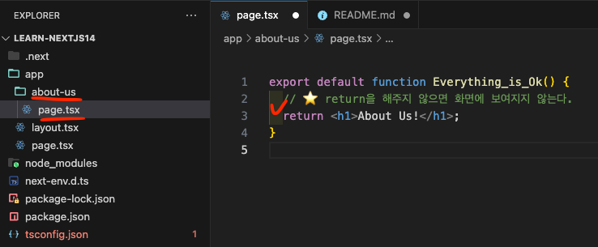
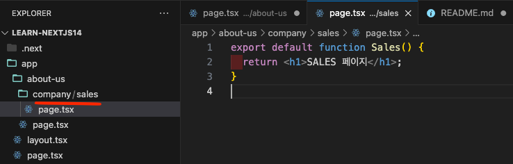
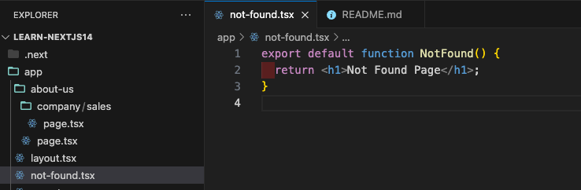
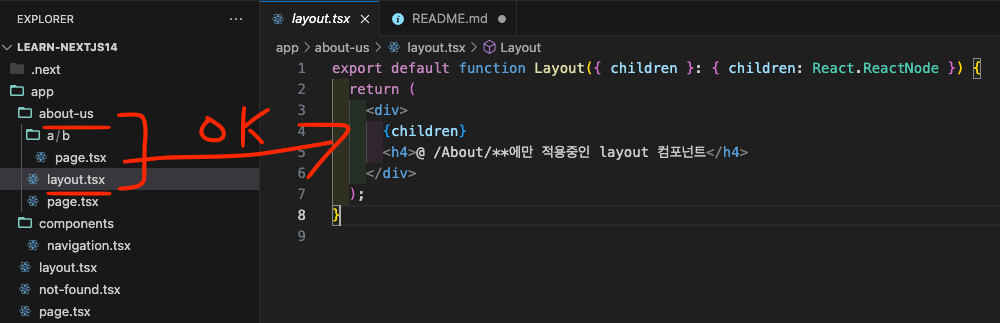
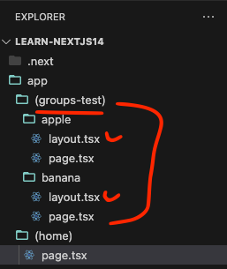
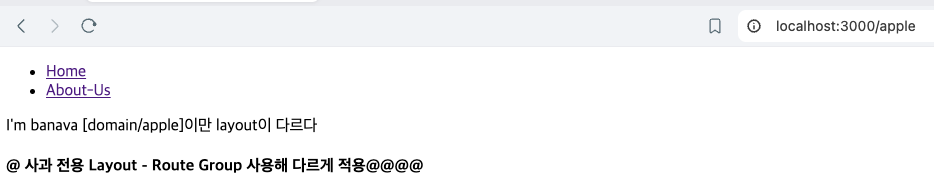
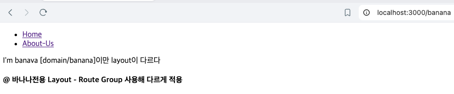
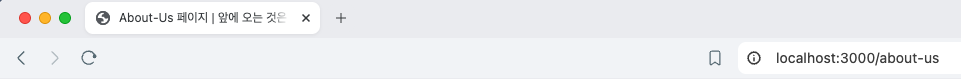
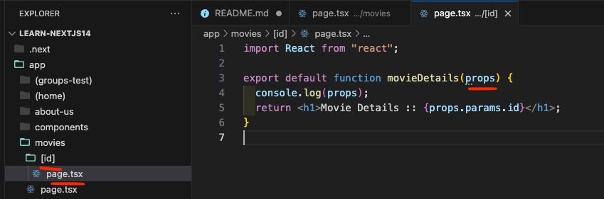
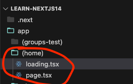

# Next.Js 14 Version

```properties
# ✨ 이전 버전을 14버전으로 업데이트 한다고해서 실행이 안되거나 하지 않는다.
#  - 이전 버전에 사용했던 `pages router` 방식은 그대로 사용 가능하기 때문
#  - NextJs 14는 두가지 Roter 방식을 지원함  (13부터 지원하긴 했었다 - 권장하기도 했었음)
#   ㄴ> Pages router , App routers
#  - 원한다면 두가지 라우팅 방식을 혼합해서 사용 또한 가능하다.
# ✍️ 주의사항으로는 한번에 버전을 올리고 마이그레이션 할 필요가 없다
#   ㄴ> 기존의 Page Router 방식을 사용해 가면서 하나씩 App Rotuer 방식으로 수정해 나가자
```

## 14이전 버전과 차이

- `Data fetching` 방식이 크게 변화 하였다.
  - `getStaticProps`, `getServerSideProps`, `getStatigPaht`와 같은 방식들이 사라졌다
- `App Rotuer`를 사용해야지만 사용할 수 있는 최신 기능을 사용할 수 있다

## APP Router 사용 방법

```properties
# ℹ️ Page Router 방식과 비교
# - 페이지는 파일 이름 기반으로 경로와 연결된다.
#   ㄴ> ✏️ URL : https://domain/about-us
#      ㄴ> 디렉토리 구조 : app/pages/about-us/index.js
#
#   ㄴ> ✏️ URL :  https://domain/about-us/list
#      ㄴ> 디렉토리 구조 :  app/pages/about-us/list.js
```

- 디렉토리 생성 후 `page.tsx or js`를 생성 후 export default function 해주면 된다.

  - ✨ 중요 포인트는 `paht`가 되는 디렉토리 내 파일의 명은 `page.?`로 파일명이 고정이라는 것이다.

  

- 하위 `Path`가 있는 URL을 구성하고 싶을 경우

  - 폴더를 원하는 Path 구조로 만든 후 `page.?`파일을 생성해 주면 된다.

    

## 404 페이지 처리

- `not-found.?` 형태로 파일을 만들어주면 된다.

  - 예약된 파일명으로 NextJs가 자동으로 해당 파일을 확인하여 읽어 404처리를 해준다.

  

## SSR vs CSR

```properties
# 💬 Rendering이란?
# - Javascript Function을 가져와서 브라우저가 이해할 수 있는 HTML로 반환하는 과정을 말한다.
```

- `CSR(Client Side Rendering)`
  - 모든 UI구축이 Client에서 javasript를 로드 후 해당 script를 통해 이뤄지는 방식
    - 따라서 Javascrip를 불러올 때까지 화면이 그려지지 않는다.
    - NextJs14에서 App Router 방식으로 `usePathname();`를 사용하려 하면 에러가 발생하는 이유이기도 하다.
- `SSR(Server Side Rendering)`
  - UI 자체가 Server(Back-end)에서 생성 후 HTML로 반환해주는 방식
    - 모든 컴포넌트오 페이지들은 먼저 Back-End에서 Render 된다.
  - NextJs14에서는 기본적(Default)으로 해당 방법으로 랜더링을 진행한다.
  - ✨ `"use client"`를 사용하면 랜더링 방식이 CSR로 바뀌는것이 아니다.
    - 번들러는 해당 모듈 임포트를 서버 코드와 클라이언트 코드 간의 바운더리로 처리한다.
    - 컴포넌트 모듈이 'use client' 지시문을 포함하면 해당 컴포넌트는 클라이언트 컴포넌트임이 보장된다.
    - `SSR`에서 랜더링 된 적정 HTML이 Client에서 `Hydration`이 필요한 컴포넌트라고 알려주는 작업이다.
      - 좀 더 쉽게 이해하자면 명령어 자체가 `"use hydration"`라고하면 더 직관적이였을 것이다.
        - NextJs에서 컴포넌트 별로 어떤것이 정적인 컴포넌트인지 Interactive한 컴포넌트인지 알려주는 것이라 생각하자

## Hydration

```properties
# 💬 쉽게 설명하자면 SSR로 받아온 정적인 HTML을 초기에 보여준 이후 React Application으로 초기화 하는 작업이다.
#   - 정적 HTML를 보여준 후 그위에 사용자는 알 수 없게 인터렉티브한 React로 덮어 씌운다고 생각해도 좋다
#   - Hydration의 사전적 뜻은 수분 공급이다. 이와같이 정적인 HTML을 보여준 후 사용자 및 SEO에 최적화 한 이 후 React로 변환 해주는 것
#     ㄴ> 초기 화면도 보여주면서 Interaction(상호작용)까지 올라가는 효과가 있다.
```

- 흐름
  - Javascript 미 로딩 (Hydration 사용 불가능 경우)
    - 메인화면 요청 -> SSR 정적인 화면 표출 -> Javascript가 아직 로딩 되지 않은 상태 -> `a href` 클릭 -> 화면 깜빡이며 이동
  - Hydration 사용가능
    - 메인화면 요청 -> SSR 정적인 화면 표출 후 `Hydration 시작` -> `a href` 클릭 -> 컴포넌트로 만들어진 화면 이동 **깜빡임 X**
- 추가
  - `useState()`를 사용해서 카운트를 올리는 테스트 시에도 화면에 버튼과 카운트는 보이지만 Javascript 미 로딩 시 **이벤트는 미작동 ㄴ함**

## Layouts

- 어느 페이지를 가더라도 첫번쨰로 시작되는 파일은 `app/layout.tsx`파일이다.

  - 해당 파일에서 랜더링을 시작해 `path` 정보를 읽고 불러오는 개념이다.

    - Parameter로 들어오는 `children`에 해당 `Path`에 맞는 컴포는트가 `prop`되는 것이다.

    ```javascript
    /** layout.tsx **/
    export const metadata = {
      title: "Next.js",
      description: "Generated by Next.js",
    };

    export default function RootLayout({
      children,
    }: {
      children: React.ReactNode,
    }) {
      return (
        <html lang="en">
          <body>
            <h6>여기에 무엇을 넣든 global하게 적용된다.</h6>
            {children}
          </body>
        </html>
      );
    }
    ```

- `layout.tsx`파일은 여러개 존재해도 상관없다.

  - 만약 `/about-us/**` 와 같이 해당 `path`뒤에 공통 적용이 필요한 Layout이 있다면 해당 directory에 만들어주면 된다.

  

- Root `layout.tsx`을 `Path`에 따라 분기하는 방법은 따로 없다.
  - `"use client"`를 사용한다해도 MetaData 사용 불가능하기에 문제가 있음
  - 방법
    - Root Layout에서 부르는 하위 페이지 컴포넌트에서 분기 처리
    - 상단에서 사용했던 Path별 구분 방법을 사용해서 layout을 여러개 두어 처리하자 ( 👎 원치않는 `path`가 앞에 붙기는 함 )
    - `Route Groups`를 사용 ( 👍 의도치 않은 path가 생성되지 않는다. )

## Route Groups

- `app` 폴더 내의 위계는 URL 경로들에 직접적으로 매핑된다. 그러나, 루트 그룹을 생성하는 것을 통해 이러한 패턴을 무시할 수 있다. 루트 그룹은 `(지정명)`으로 폴더를 만들어 해당 폴더를 구성하면 된다.

  - URL 구조에 영향을 주지 않으면서 루트들을 조직하는 경우
  - 레이아웃에 특정한 루트 세그먼트를 도입하는 경우
  - 애플리케이션을 분할해서 여러 개의 루트 레이아웃을 생성하는 경우

- 간단한 테스트

  - `localhost:3000/{지정 패스}`에따라 다르게 `layout.tsx`를 적용하게 함

    - 주의사항은 `layout.tsx` 하나에서 분기처리가 아닌 각기 다른 2개의 layout을 만들어 그룹별로 적용한 것

  - 폴더 구조

    

  - 결과

    - apple

      

    - banana

      

## MeataData

- 레이아웃과 페이짐나 메타데이터를 export 할 수 있다
- 각기 다른 레이아웃에 적용하면 덮어씌워지는 개념이 아닌 `Merge`개념이다!
  - 다른 Root에서 `Title` 현재 위치의 화면 컴포넌트에서 `Description`이라면 2개가 합쳐져서 표시 된다.
- 사용 방법
  ```javascript
  export const metadata = {
    title: "내가 원하는 타이틀",
    description:
      "레이아웃과 페이지라면 적용이 가능하다! 단 Framework이기에 변수명은 고정이다",
  };
  ```
- Template를 사용하면 자주 사용되는 문자은 고정으로 하고 변수를 받아 넣을 수 있다.

  - 예시

    ```javascript
    /** Root Layout.tsx */
    export const metadata: Metadata = {
      title: {
        template: "%s |  앞에 오는 것은 변수로 치환 함",
        default: "기본값",
      },
      description: "설명 설명",
    };

    /** about-us pase.tsx */
    export const metadata: Metadata = {
      title: "About-Us 페이지",
    };
    ```

  - 결과

    

## Dynamic Routes

- `Path Variable` 이나 `Query Params`를 받는 방법

  - `Path Variable`

    - 폴더의 구조내 `[원하는 Key명]`의 형태를 만든 후 하위에 `page.tsx`파일을 두면 된다.
    - 예시

      

    - 결과 : `http://localhost:3000/movies?page=21`
      ```properties
      /movies/123
      { params: { id: '123' }, searchParams: { page: '21' } }
      GET /movies/123?page=21 200 in 81ms
      ```
    - 효율적 코드 변환

      ```javascript
      import React from "react";
      // Interface를 통해 값 고정
      interface Props {
        params: { id: string };
        searchParams: { page: string };
      }

      export default function movieDetails({ params, searchParams }: Props) {
        return (
          <h1>
            Movie Details :: {params.id} || {searchParams.page}
          </h1>
        );
      }
      ```

  - `Query Params`
    - 컴포넌트 내 파라미터를 받으면 된다 -> 아무 파라미터명이나 가능하다
    - 예시
      ```javascript
      export default function movieMain(zero) {
        // { params: {}, searchParams: { page: '21' } }
        console.log(zero);
        return (
          <h1>
            Movie 메인페이지 - 해당 화면 컴포넌트가 없으면 "domain/movies" 404가
            뜸
          </h1>
        );
      }
      ```

## CSR에서의 Data Fetching

- `SSR`와의 차이를 위해 ReMind를 위해 작성함
- 예시

  ```javascript
  "use client";

  import { useEffect, useState } from "react";

  export default function BlackGome() {
    // 로딩 상태 체크를 위한 변수
    const [isLoading, setIsLoading] = useState(true);
    // 데이터를 담을 변수
    const [movie, setMovie] = useState([]);

    // 1. 해당 컴포넌트가 실행될때 최초 실행을 위함
    useEffect(() => {
      getMovie();
    }, []);

    // 2. 비동기 통신을 통해 데이터를 요청
    const getMovie = async () => {
      const res = await fetch(
        "https://nomad-movies.nomadcoders.workers.dev/movies"
      );
      const json = await res.json();
      // 2.1 변수에 데이터 삽입
      setMovie(json);
      // 2.2 로딩 False로 변환
      setIsLoading(false);
    };

    return (
      <>
        <h1>{isLoading ? "Loading ..." : JSON.stringify(movie)}</h1>
      </>
    );
  }
  ```

## SSR에서의 Data Fetching

```properties
# ℹ️ NextJs는 "Frame Work"이기에 내부에서 API를 요청이 가능하다!
#  - Fetch 된 URL을 자동 캐싱해줌
```

- 주의 사항
  - `default`함수 외부에서 API Fetching 요청을 하는 것이다
- CSR, SSR 각각의 장단점이 있으니 원하는 형식을 골라서 사용하자
- 예시

  ```javascript
  // 1. 목록을 받아올 API 주소
  const URL = "https://nomad-movies.nomadcoders.workers.dev/movies";

  /**
   * ✨ 2. Server에서 이뤄지는 데이터 Fetching
   */
  async function getMovies() {
    try {
      const response = await fetch(URL);
      if (!response.ok) throw new Error("Network response was not ok");
      const data = await response.json();
      return data;
    } catch (error) {
      console.error("Failed to fetch movies:", error);
    }
  }

  /**
   * ℹ️ await를 사용하기위해 UI를 그려주는 default 함수를 "async"로 변경해 줘야한다.
   */
  export default async function BlackGome() {
    // 3. await를 사용해서 데이터를 불러오면 끝
    const movies = await getMovies();
    return (
      <>
        <h1>{JSON.stringify(movies)}</h1>
      </>
    );
  }
  ```

## SSR에서의 Loading 적용

- 자동으로 SSR방식으로 Data Fetching 시 내가 지정한 로딩 화면을 보여준다
- 주의사항
  - 파일명은 `laoding.tsx` 고정이다.
  - Loading을 사용하려는 파일의 같은 디렉토리 내에 위치해야한다.
- 예시

  

  ```javascript
  // loading.tsx
  import React from "react";

  export default function loading() {
    return <div>loading</div>;
  }
  ```

## Parallel Data Fetching (병렬 처리)

- SSR에서 각각의 요청은 `await`로 선언되어 있기에 순차 처리를 하면 첫번째 요청의 처리 시간만큼 두번째 요청이 진행하지 않는다.
  - 따라서 `const [대상1, 대상2] = await Promise.all([ 불러오는 대상 , 불러오는 대상2 ])`를 사용해서 병렬처리를 해주자
- 예시

  ```javascript
  import React from "react";
  import { API_URL } from "../../(home)/page";

  interface Props {
    params: { id: string };
    searchParams: { page: string };
  }

  const getMovie = async (id: string) => {
    const response = await fetch(`${API_URL}/${id}`);
    return await response.json();
  };

  const getVideos = async (id: string) => {
    const response = await fetch(`${API_URL}/${id}/videos`);
    return await response.json();
  };

  export default async function movieDetails({ params, searchParams }: Props) {
    // ✨ await Promise.all를 사용해서 병렬 처리함
    const [movie, videos] = await Promise.all([
      getMovie(params.id),
      getVideos(params.id),
    ]);
    return (
      <>
        <h1>
          Movie Name : {movie.title} || Movie Id : {params.id}
        </h1>
        <p>Vidoes : {JSON.stringify({ videos })}</p>
      </>
    );
  }
  ```
